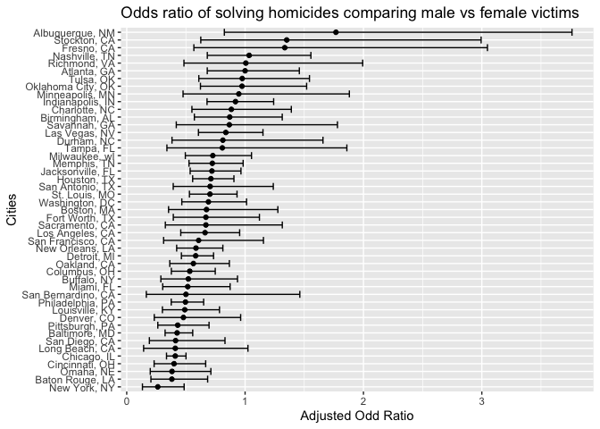
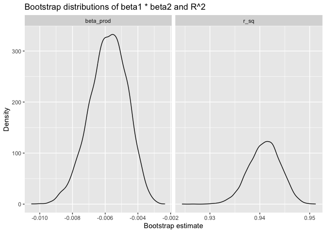
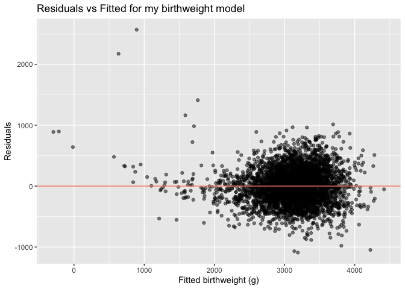
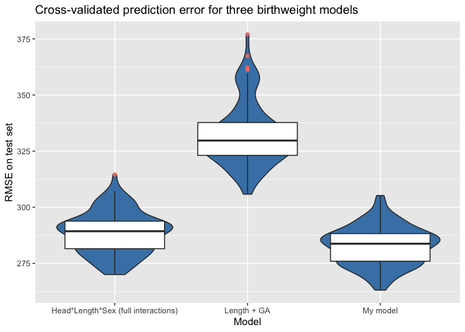

p8105_hw6_yg3099
================
daisy_gui
2025-12-01

``` r
library(ggplot2)
library(tidyverse)
```

    ## ── Attaching core tidyverse packages ──────────────────────── tidyverse 2.0.0 ──
    ## ✔ dplyr     1.1.4     ✔ readr     2.1.5
    ## ✔ forcats   1.0.0     ✔ stringr   1.5.1
    ## ✔ lubridate 1.9.4     ✔ tibble    3.2.1
    ## ✔ purrr     1.1.0     ✔ tidyr     1.3.1
    ## ── Conflicts ────────────────────────────────────────── tidyverse_conflicts() ──
    ## ✖ dplyr::filter() masks stats::filter()
    ## ✖ dplyr::lag()    masks stats::lag()
    ## ℹ Use the conflicted package (<http://conflicted.r-lib.org/>) to force all conflicts to become errors

``` r
library(broom)
library(purrr)
library(p8105.datasets)
library(modelr)
```

    ## 
    ## Attaching package: 'modelr'
    ## 
    ## The following object is masked from 'package:broom':
    ## 
    ##     bootstrap

## Problem 1

First, data is read from csv file.

``` r
homi_raw = read_csv("data/homicide-data.csv")
```

    ## Rows: 52179 Columns: 12
    ## ── Column specification ────────────────────────────────────────────────────────
    ## Delimiter: ","
    ## chr (9): uid, victim_last, victim_first, victim_race, victim_age, victim_sex...
    ## dbl (3): reported_date, lat, lon
    ## 
    ## ℹ Use `spec()` to retrieve the full column specification for this data.
    ## ℹ Specify the column types or set `show_col_types = FALSE` to quiet this message.

Then clean the data.

``` r
homi_df =
  homi_raw |>
  mutate(
    city_state = str_c(city, state, sep = ", "), # city_state variable
    resolved = as.numeric(disposition == "Closed by arrest"), # resolved variable
    victim_age = as.numeric(victim_age) # ensure numeric victim age
  ) |>
  
  # omit cities with missing or incorrect data
  filter(!(city_state %in% c("Dallas, TX",
                             "Phoenix, AZ",
                             "Kansas City, MO",
                             "Tulsa, AL"))) |> 

  # limit victim race to white or black
  filter(victim_race %in% c("White", "Black")) |>

  # set baselines
  mutate(
    victim_race = fct_relevel(victim_race, "White"),
    victim_sex = fct_relevel(victim_sex, "Female")
  )
```

    ## Warning: There was 1 warning in `mutate()`.
    ## ℹ In argument: `victim_age = as.numeric(victim_age)`.
    ## Caused by warning:
    ## ! NAs introduced by coercion

Data is cleaned by creating a city_state variable and a variable on
whether the homicide is solved. Cities with missing or incorrect data
are omitted. The analysis is limited to white or black victims. And
victim_age is changed from character into numeric.

Now perform logistic regression on predictors of whether cases are
resolved in Baltimore.

``` r
# select Baltimore city
balti_df =
  homi_df |> 
  filter(city_state == "Baltimore, MD") # select Baltimore city

# logistic regression
balti_log =
  balti_df |> 
  glm(resolved ~ victim_age + victim_sex + victim_race,
      data = _,
      family = binomial())

# tidy logistic regression result and calculate OR
tidy_balti = 
  balti_log |> 
  broom::tidy(conf.int = TRUE) |> 
  mutate(OR = exp(estimate),
         OR_low = exp(conf.low),
         OR_high = exp(conf.high))

balti_sex = 
  tidy_balti |>
  filter(term == "victim_sexMale") |> 
  select(term, OR, OR_low, OR_high)
```

The adjusted odds ratio comparing male victims to female victims is
0.426 with 95% CI: 0.324,0.558, when holding age and race constant.

After adjusting for victim age and race, male homicide cases have 0.43
times the odds of being solved compared to female cases.

Since the 95% confidence interval of odd ratio does not include 1, it is
statistically significant that homicide cases in Baltimore involving
male victims have lower odds of being solved compared to cases involving
female victims.

Now calculate odd ratio and CIs on all cities.

``` r
# glm on all cities
cities_log =
  homi_df |> 
  nest(city_row = -city_state) |> 
  mutate(
    models = map(
      city_row,
      \(df) glm(
        resolved ~ victim_age + victim_sex + victim_race,
        data = df,
        family = binomial()
      )
    ),
    results = map(
      models,
      \(mod) broom::tidy(mod, conf.int = TRUE)
    )
  ) |>
  select(-city_row, -models) |>
  unnest(results)
```

    ## Warning: There were 43 warnings in `mutate()`.
    ## The first warning was:
    ## ℹ In argument: `results = map(models, function(mod) broom::tidy(mod, conf.int =
    ##   TRUE))`.
    ## Caused by warning:
    ## ! glm.fit: fitted probabilities numerically 0 or 1 occurred
    ## ℹ Run `dplyr::last_dplyr_warnings()` to see the 42 remaining warnings.

``` r
# odd ratio and filter sex
cities_OR =
  cities_log |> 
  filter(term == "victim_sexMale") |> 
  mutate(
    OR      = exp(estimate),
    OR_low  = exp(conf.low),
    OR_high = exp(conf.high)
  )
```

A plot on ORs and CIs of solving homicides comparing male victims to
female victims for each city can be created.

``` r
cities_OR |> 
  ggplot(aes(x = reorder(city_state, OR), y = OR)) +
  geom_point() +
  geom_errorbar(aes(ymin = OR_low, ymax = OR_high)) +
  coord_flip() +
  labs(
    x = "Cities",
    y = "Adjusted Odd Ratio",
    title = "Odds ratio of solving homicides comparing male vs female victims"
  ) 
```

<!-- -->

Across the 50 cities, most adjusted odds ratios lie below 1 and
confidence intervals do not cross 1, indicating that homicide cases
involving male victims are generally less likely to be solved than those
involving female victims after adjusting for age and race.

A few cities show ORs above 1, but their confidence intervals are wide,
with lower bound of CI lower than 1, reflecting limited sample sizes or
significance.

## Problem 2

Import and clean data from package and set seed.

``` r
set.seed(1)

data("weather_df")

weather_clean = 
  weather_df |> 
  select(tmax, tmin, prcp) |> 
  drop_na()
```

Observations with NA are omitted and only reponse and predictors are
kept as variables.

Define bootstrapping dunction.

``` r
boot_func = function(df) {
  sample_frac(df, replace = TRUE)
}
```

Save 5000 bootstrap samples.

``` r
n_boot = 5000

boot_straps = 
  tibble(strap_number = 1:n_boot) |>
  mutate(
    strap_sample = map(strap_number, \(i) boot_func(weather_clean))
  )

boot_straps
```

    ## # A tibble: 5,000 × 2
    ##    strap_number strap_sample        
    ##           <int> <list>              
    ##  1            1 <tibble [2,171 × 3]>
    ##  2            2 <tibble [2,171 × 3]>
    ##  3            3 <tibble [2,171 × 3]>
    ##  4            4 <tibble [2,171 × 3]>
    ##  5            5 <tibble [2,171 × 3]>
    ##  6            6 <tibble [2,171 × 3]>
    ##  7            7 <tibble [2,171 × 3]>
    ##  8            8 <tibble [2,171 × 3]>
    ##  9            9 <tibble [2,171 × 3]>
    ## 10           10 <tibble [2,171 × 3]>
    ## # ℹ 4,990 more rows

Linear regression on each bootstrap sample.

``` r
bootstrap_results = 
  boot_straps |>
  mutate(
    models = map(
      strap_sample,
      \(df) lm(tmax ~ tmin + prcp, data = df)
    ),
    glance_out = map(models, broom::glance),
    tidy_out   = map(models, broom::tidy)
  ) |>
  transmute(
    strap_number,
    r_sq = map_dbl(glance_out, "r.squared"),
    beta_prod = map_dbl(
      tidy_out,
      \(x) {
        b1 = x |> filter(term == "tmin") |> pull(estimate)
        b2 = x |> filter(term == "prcp") |> pull(estimate)
        b1 * b2
      }
    )
  )

bootstrap_results
```

    ## # A tibble: 5,000 × 3
    ##    strap_number  r_sq beta_prod
    ##           <int> <dbl>     <dbl>
    ##  1            1 0.941  -0.00510
    ##  2            2 0.937  -0.00452
    ##  3            3 0.945  -0.00635
    ##  4            4 0.942  -0.00621
    ##  5            5 0.943  -0.00591
    ##  6            6 0.942  -0.00650
    ##  7            7 0.939  -0.00597
    ##  8            8 0.939  -0.00456
    ##  9            9 0.938  -0.00632
    ## 10           10 0.935  -0.00507
    ## # ℹ 4,990 more rows

Turn results into long table and plot the distribution.

``` r
# turn linear regression results of bootstrap samples into long table
boot_long = 
  bootstrap_results |>
  pivot_longer(
    cols = c(r_sq, beta_prod),
    names_to = "quantity",
    values_to = "estimate"
  )

# plot distributions
boot_long |>
  ggplot(aes(x = estimate)) +
  geom_density() +
  facet_grid(~ quantity, scales = "free") +
  labs(
    x = "Bootstrap estimate",
    y = "Density",
    title = "Bootstrap distributions of beta1 * beta2 and R^2"
  )
```

<!-- -->

The bootstrap distribution of $\beta_1\beta_2$ is approximately unimodal
with a slight right skew. Most estimates are between –0.010 and –0.003
and centered near –0.0055. The shape shows moderate variability, but the
estimates remain consistently negative across resamples. This shows a
stable direction for the combined effect of tmin and prcp.

The bootstrap distribution of $R^2$ is tightly concentrated and nearly
symmetric. Estimates lie mostly between 0.93 and 0.95, with a clear peak
around 0.94. The narrow spread indicates little bootstrap variability.
This shows that the overall model fit is highly stable and that tmin and
prcp consistently explain a large proportion of the variability in tmax.

Now the quantiles can also be calculated.

``` r
ci_results = 
  boot_long |>
  group_by(quantity) |>
  summarize(
    ci_lower = quantile(estimate, 0.025),
    ci_upper = quantile(estimate, 0.975)
  )

ci_results
```

    ## # A tibble: 2 × 3
    ##   quantity  ci_lower ci_upper
    ##   <chr>        <dbl>    <dbl>
    ## 1 beta_prod -0.00821 -0.00377
    ## 2 r_sq       0.934    0.947

Using the 2.5% and 97.5% empirical quantiles of the bootstrap samples,
the 95% confidence interval for $\hat{r}^2$ is approximately (-0.00821,
-0.00377).

The 95% confidence interval for $\hat{\beta}_1\hat{\beta}_2$is
approximately (0.934, 0.947).

## Problem 3

First,set seed, load and clean data.

``` r
set.seed(1)
bw_raw = read_csv("data/birthweight.csv")
```

    ## Rows: 4342 Columns: 20
    ## ── Column specification ────────────────────────────────────────────────────────
    ## Delimiter: ","
    ## dbl (20): babysex, bhead, blength, bwt, delwt, fincome, frace, gaweeks, malf...
    ## 
    ## ℹ Use `spec()` to retrieve the full column specification for this data.
    ## ℹ Specify the column types or set `show_col_types = FALSE` to quiet this message.

Clean data for regression.

``` r
# turn sex, race, malform in to factors
bw_df = 
  bw_raw |> 
  mutate(
    babysex = factor(babysex, levels = c(1, 2), labels = c("male", "female")),
    frace   = factor(frace),
    mrace   = factor(mrace),
    malform = factor(malform, levels = c(0, 1), labels = c("absent", "present"))
  )

# clean for missing data
bw_df |> 
  summarize(across(everything(), ~sum(is.na(.)))) |> 
  pivot_longer(everything(),
               names_to = "variable",
               values_to = "n_missing") |> 
  arrange(desc(n_missing))
```

    ## # A tibble: 20 × 2
    ##    variable n_missing
    ##    <chr>        <int>
    ##  1 babysex          0
    ##  2 bhead            0
    ##  3 blength          0
    ##  4 bwt              0
    ##  5 delwt            0
    ##  6 fincome          0
    ##  7 frace            0
    ##  8 gaweeks          0
    ##  9 malform          0
    ## 10 menarche         0
    ## 11 mheight          0
    ## 12 momage           0
    ## 13 mrace            0
    ## 14 parity           0
    ## 15 pnumlbw          0
    ## 16 pnumsga          0
    ## 17 ppbmi            0
    ## 18 ppwt             0
    ## 19 smoken           0
    ## 20 wtgain           0

The regression model on birthweight I would propose would be a linear
model includes infant sex, head circumference, length, gestational age,
maternal pre-pregnancy BMI, pregnancy weight gain, and the number of
cigarettes smoked per day.

``` r
lm_prop = 
  lm(bwt ~ babysex + bhead + blength + gaweeks +
           ppbmi + wtgain + smoken,
     data = bw_df)

lmprop_tidy = broom::tidy(lm_prop)
```

Now we can plot the model residuals against fitted values.

``` r
bw_diag_df = 
  bw_df |> 
  add_predictions(lm_prop) |> 
  add_residuals(lm_prop)

bw_diag_df |> 
  ggplot(aes(x = pred, y = resid)) +
  geom_point(alpha = 0.5) +
  geom_hline(yintercept = 0, color = "salmon") +
  labs(
    x = "Fitted birthweight (g)",
    y = "Residuals",
    title = "Residuals vs Fitted for my birthweight model"
  )
```

<!-- -->

According to the plot, most residuals are centered around zero with no
strong systematic pattern, which suggests that the linearity assumption
is reasonably met for the proposed model.

We can compare my proposed model with the model using length at birth
and gestational age as predictors:

``` r
mod_len_ga = 
  lm(bwt ~ blength + gaweeks, data = bw_df)
```

We can also compare it to the model using head circumference, length,
sex, and all interactions between these:

``` r
mod_int = 
  lm(bwt ~ bhead * blength * babysex, data = bw_df)
```

Creates repeated train/test splits and converts into list-columns.

``` r
cv_df = 
  crossv_mc(bw_df, 100) |> 
  mutate(
    train = map(train, as_tibble),
    test  = map(test,  as_tibble)
  )

cv_df
```

    ## # A tibble: 100 × 3
    ##    train                 test                .id  
    ##    <list>                <list>              <chr>
    ##  1 <tibble [3,473 × 20]> <tibble [869 × 20]> 001  
    ##  2 <tibble [3,473 × 20]> <tibble [869 × 20]> 002  
    ##  3 <tibble [3,473 × 20]> <tibble [869 × 20]> 003  
    ##  4 <tibble [3,473 × 20]> <tibble [869 × 20]> 004  
    ##  5 <tibble [3,473 × 20]> <tibble [869 × 20]> 005  
    ##  6 <tibble [3,473 × 20]> <tibble [869 × 20]> 006  
    ##  7 <tibble [3,473 × 20]> <tibble [869 × 20]> 007  
    ##  8 <tibble [3,473 × 20]> <tibble [869 × 20]> 008  
    ##  9 <tibble [3,473 × 20]> <tibble [869 × 20]> 009  
    ## 10 <tibble [3,473 × 20]> <tibble [869 × 20]> 010  
    ## # ℹ 90 more rows

Fit three models on each train.

``` r
cv_models = 
  cv_df |> 
  mutate(
    mod_my     = map(train, ~lm(bwt ~ babysex + bhead + blength + gaweeks +
                                      ppbmi + wtgain + smoken, data = .x)),
    mod_len_ga = map(train, ~lm(bwt ~ blength + gaweeks, data = .x)),
    mod_int    = map(train, ~lm(bwt ~ bhead * blength * babysex, data = .x))
  )
```

Calculate RSME for each model:

``` r
cv_rmse = 
  cv_models |> 
  mutate(
    rmse_my     = map2_dbl(mod_my,     test, ~rmse(model = .x, data = .y)),
    rmse_len_ga = map2_dbl(mod_len_ga, test, ~rmse(model = .x, data = .y)),
    rmse_int    = map2_dbl(mod_int,    test, ~rmse(model = .x, data = .y))
  ) |> 
  select(rmse_my, rmse_len_ga, rmse_int)
```

The RMSE distribution can be plotted:

``` r
# convert into long table for plotting
cv_long = 
  cv_rmse |> 
  pivot_longer(
    everything(),
    names_to  = "model",
    values_to = "rmse"
  ) |> 
  mutate(
    model = recode(model,
                   rmse_my     = "My model",
                   rmse_len_ga = "Length + GA",
                   rmse_int    = "Head*Length*Sex (full interactions)")
  )

# plot distribution
cv_long |> 
  ggplot(aes(x = model, y = rmse)) +
  geom_violin(fill = "steelblue") +
  geom_boxplot(outlier.alpha = 0.8, outlier.color = "salmon") +
  labs(
    x = "Model",
    y = "RMSE on test set",
    title = "Cross-validated prediction error for three birthweight models"
  ) 
```

<!-- -->

The violin plot shows the distribution of cross-validated RMSE values
for the three birthweight models. The Length + GA model has the highest
RMSE values and the widest spread, which means it has poorer and less
stable predictive performance. The Head × Length × Sex interaction model
has lower RMSEs and a tighter distribution than the former one.

``` r
cv_summary = 
  cv_long |> 
  group_by(model) |> 
  summarize(
    mean_rmse = mean(rmse),
    sd_rmse   = sd(rmse)
  )

cv_summary
```

    ## # A tibble: 3 × 3
    ##   model                               mean_rmse sd_rmse
    ##   <chr>                                   <dbl>   <dbl>
    ## 1 Head*Length*Sex (full interactions)      289.    9.22
    ## 2 Length + GA                              332.   14.0 
    ## 3 My model                                 283.    8.51

The Length + GA model has the largest mean RMSE (332.23) and the highest
standard deviation (13.95). The full interaction model has a lower mean
RMSE (288.60) and standard deviation (9.22). The model I proposed has
the lowest mean RMSE (282.72) and standard deviation (8.51).

The model I proposed shows the lowest RMSE values overall and relatively
small variation. It provides the most accurate and consistent
predictions among the three.
